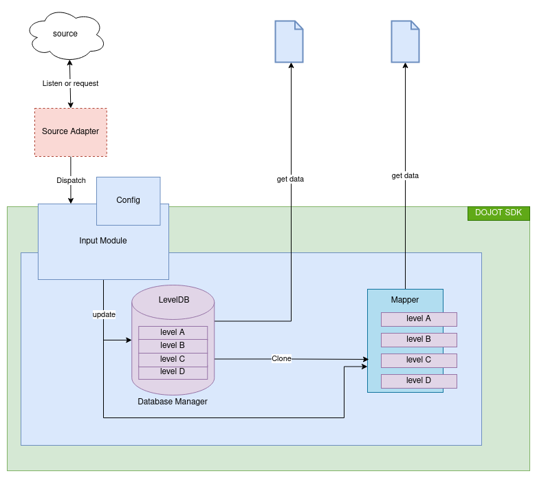
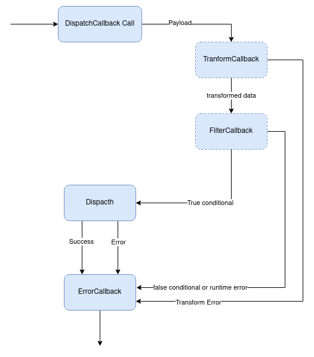

# Local Persistence Module

This module is responsible for:
- Storing data locally
- Automating data entry in the database

The following image summarizes the module layers and data flow:

<p align="center">

</p>

# Table of Contents

1. [LocalPersistenceManager](#LocalPersistenceManager)
2. [InputPersister](#InputPersister)
1. [InputPersisterArgs](#InputPersisterArgs)

# LocalPersistenceManager

This class module is responsible for managing the creation, writing, reading, batching and levels of the database.

## Usage

When starting an instance of the LocalPersistenceManager, the following parameters can be set:

* readInMemory - a boolean that determines whether a memory copy of the database will be generated. By default the value is true;
* databasePath - set the database directory path. By default the path is './dojot_persistence'.

```js

// Instantiate a local persistence manager
const localPersistence = new LocalPersistenceManager(logger, true);

// Initiate local persistence database
localPersistence.init().then(() => {
    // Successful operation handling 
});

```

## Public methods

### `.initializeLevel(sublevel, options)`

Initializes or loads the disk sublevel, copies the sublevel into memory and returns a promise with them. If in-memory database is disabled, the return value for sublevelInMemory will be null. By default  the 'options' parameter  is:
```js
{
  valueEncoding: 'utf8',
  keyEncoding: 'utf8',
}
```
Example of using this method:

```js

// Instantiate a local persistence manager
const localPersistence = new LocalPersistenceManager(logger, true, 'dojot_sdk_database');

// Initiate local persistence database
localPersistence.init().then(() => {
    // Initiate the sublevels
    localPersistence.initializeLevel(sublevelName).then(([ sublevelInDisk, sublevelInMemory ]) => {
        // Successful initialization handling 
    }); 

});

```

### `.initializeDiskLevel(sublevel, options)`

Initialize or load the disk sublevel and return a promise with it. By default  the 'options' parameter  is:
```js
{
  valueEncoding: 'utf8',
  keyEncoding: 'utf8',
}
```

Example of using this method:
```js
// Instantiate a local persistence manager
const localPersistence = new LocalPersistenceManager(logger, true);

// Initiate local persistence database
localPersistence.init().then(() => {
    localPersistence.initializeDiskLevel(sublevelName).then( (sublevel) => {
        // Successful initialization handling 
    });
});
```

### `.getDiskLevel(sublevel)`

Retrieves a disk level that has already been initialized in the database.

Example of using this method:
```js
// Instantiate a local persistence manager
const localPersistence = new LocalPersistenceManager(logger, true);

// Initiate local persistence database
localPersistence.init().then(() => {
    localPersistence.initializeDiskLevel(sublevelName).then( (sublevel) => {
        // Successful initialization handling 
    });

    ...

    localPersistence.getDiskLevel(sublevelName).then( (sublevel) => {
        // Successful handling 
    })
});
```

### `.getMemoryLevel(sublevel)`

Retrieves a memory level that has already been initialized in the database. This is a promisify method. 

Example of using this method:
```js
// Instantiate a local persistence manager
const localPersistence = new LocalPersistenceManager(logger, true);

// Initiate local persistence database
localPersistence.init().then(() => {
    localPersistence.initializeLevel(sublevelName).then([ sublevel, sublevelInMemory ] => {
        // Successful initialization handling 
    });

    ...

    localPersistence.getMemoryLevel(sublevelName).then( (sublevel) => {
        // Successful handling 
    })
});
```

### `.executeBatchForLevels(operations)`

Executes a set of batch operations for several sublevels and returns a promise.
This is the following struct to 'operations' parameter:

```js
Map {
    'sublevelName' => Object {
        config: Object {
            name?: 'sublevelname',
            source?: <path_to_field> 
            options: Object {
               keyEncoding: 'utf8' | 'json',
               valueEncoding: 'utf8' | 'json',
            },
        },
        operation: [
            Object {
                type: 'put' | 'del',
                key: 'value' | {},
                value: 'value' | {},
            }
        ]
    }
}
```

### `.put(sublevel, key, value)`

Inserts an entry into a level and returns a promise for this operation. This ensures consistency if there is an in-memory copy. 

Example of using this method:
```js
// Instantiate a local persistence manager
const localPersistence = new LocalPersistenceManager(logger, true);

// Initiate local persistence database
localPersistence.init().then(() => {    
    localPersistence.put('level1',' key', 'value').then(() => {
        // Successful operation handling 
    }.catch((error) => {
        // Unsuccessful operation handling 
    });
}
```

### `.del(sublevel, key)`

Removes an entry from a level and returns a promise for this operation with the deleted value. This ensures consistency if there is an in-memory copy.
Example of using this method:
```js
// Instantiate a local persistence manager
const localPersistence = new LocalPersistenceManager(logger, true);

// Initiate local persistence database
localPersistence.init().then(() => {    
    localPersistence.del('level1',' key').then((deletedValue) => {
        // Successful operation handling 
    }.catch((error) => {
        // Unsuccessful operation handling 
    });
}
```

### `.getInDisk(sublevel, key)`

Retrieves an one-level value from disk, returning a promise for the found value.

Example of using this method:
```js
// Instantiate a local persistence manager
const localPersistence = new LocalPersistenceManager(logger, true);

// Initiate local persistence database
localPersistence.init().then(() => {    
    localPersistence.getInDisk('level1',' key').then((value) => {
        // Successful operation handling 
    }.catch((error) => {
        // Unsuccessful operation handling 
    });
}
```

### `.getInMemory(sublevel, key)`

Retrieves an one-level value from memory, returning a promise of the found value.
Note: This method does not work if the in-memory database is disabled.

Example of using this method:
```js
// Instantiate a local persistence manager
const localPersistence = new LocalPersistenceManager(logger, true);

// Initiate local persistence database
localPersistence.init().then(() => {    
    localPersistence.getInMemory('level1',' key').then((value) => {
        // Successful operation handling 
    }.catch((error) => {
        // Unsuccessful operation handling 
    });
}
```

### `.get(sublevel, key)`

Retrieves an one-level value from memory if there is a copy of the database in memory, otherwise, retrieves from disk. This method returns a promisse with the retrieved value.

Example of using this method:
```js
// Instantiate a local persistence manager
const localPersistence = new LocalPersistenceManager(logger, true);

// Initiate local persistence database
localPersistence.init().then(() => {    
    localPersistence.get('level1',' key').then((value) => {
        // Successful operation handling 
    }.catch((error) => {
        // Unsuccessful operation handling 
    });
}
```

### `.createKeyStreamInMemory(sublevel)`

Retrieves an one level key stream from memory. This method returns a promisse with the key stream.

Example of using this method:
```js
// Instantiate a local persistence manager
const localPersistence = new LocalPersistenceManager(logger, true);

// Initiate local persistence database
localPersistence.init().then(() => {    
    localPersistence.createKeyStreamInMemory('level1').then((stream) => {
        stream.on('data', (data) => {
            // stream
        })
    }).catch((error) => {
        // Unsuccessful operation handling 
    });
}
```

### `.createValueStreamInMemory(sublevel)`

Retrieves a one level value stream from memory. This method returns a promisse with the value stream.

Example of using this method:
```js
// Instantiate a local persistence manager
const localPersistence = new LocalPersistenceManager(logger, true);

// Initiate local persistence database
localPersistence.init().then(() => {    
    localPersistence.createValueStreamInMemory('level1').then((stream) => {
        stream.on('data', (data) => {
            // stream
        })
    }).catch((error) => {
        // Unsuccessful operation handling 
    });
}
```

### `.createStreamInMemory(sublevel)`

Retrieves an one level entry stream from memory. This method returns a promisse with the entry stream.

Note: The stream returned by this method must not be applied to a Default Node pipeline. Because the default node stream operates with buffers while the levelDB stream operates with object of key-value.

Example of using this method:
```js
// Instantiate a local persistence manager
const localPersistence = new LocalPersistenceManager(logger, true);

// Initiate local persistence database
localPersistence.init().then(() => {    
    localPersistence.createStreamInMemory('level1').then((stream) => {
        stream.on('data', (data) => {
            // stream
        })
    }).catch((error) => {
        // Unsuccessful operation handling 
    });
}
```

### `.createKeyStreamInDisk(sublevel)`

Retrieves an one level key stream from disk. This method returns a promisse with the key stream.

Example of using this method:
```js
// Instantiate a local persistence manager
const localPersistence = new LocalPersistenceManager(logger, true);

// Initiate local persistence database
localPersistence.init().then(() => {    
    localPersistence.createKeyStreamInDisk('level1').then((stream) => {
        stream.on('data', (data) => {
            // stream
        })
    }).catch((error) => {
        // Unsuccessful operation handling 
    });
}
```

### `.createValueStreamInDisk(sublevel)`

Retrieves a one level value stream from disk. This method returns a promisse with the value stream.

Example of using this method:
```js
// Instantiate a local persistence manager
const localPersistence = new LocalPersistenceManager(logger, true);

// Initiate local persistence database
localPersistence.init().then(() => {    
    localPersistence.createValueStreamInDisk('level1').then((stream) => {
        stream.on('data', (data) => {
            // stream
        })
    }).catch((error) => {
        // Unsuccessful operation handling 
    });
}
```

### `.createStreamInDisk(sublevel)`

Retrieves a one level entry stream from disk. This method returns a promisse with the entry stream.

Note: The stream returned by this method must not be applied to a Default Node pipeline. Because the default node stream operates with buffers while the levelDB stream operates with object of key-value.

Example of using this method:
```js
// Instantiate a local persistence manager
const localPersistence = new LocalPersistenceManager(logger, true);

// Initiate local persistence database
localPersistence.init().then(() => {    
    localPersistence.createStreamInDisk('level1').then((stream) => {
        stream.on('data', (data) => {
            // stream
        })
    }).catch((error) => {
        // Unsuccessful operation handling 
    });
}
```

### `.createKeyStream(sublevel)`

Retrieves an one-level key stream from memory if there is a copy of the database in memory, otherwise, retrieves from disk. This method returns a promisse with the key stream.

Example of using this method:
```js
// Instantiate a local persistence manager
const localPersistence = new LocalPersistenceManager(logger, true);

// Initiate local persistence database
localPersistence.init().then(() => {    
    localPersistence.createKeyStream('level1').then((stream) => {
        stream.on('data', (data) => {
            // stream
        })
    }).catch((error) => {
        // Unsuccessful operation handling 
    });
}
```

### `.createValueStream(sublevel)`

Retrieves an one-level value stream from memory if there is a copy of the database in memory, otherwise, retrieves from disk. This method returns a promisse with the value stream.

Example of using this method:
```js
// Instantiate a local persistence manager
const localPersistence = new LocalPersistenceManager(logger, true);

// Initiate local persistence database
localPersistence.init().then(() => {    
    localPersistence.createValueStream('level1').then((stream) => {
        stream.on('data', (data) => {
            // stream
        })
    }).catch((error) => {
        // Unsuccessful operation handling 
    });
}
```

### `.createStream(sublevel)`

Retrieves an one-level entry stream from memory if there is a copy of the database in memory, otherwise, retrieves from disk. This method returns a promisse with the entry stream.

Note: The stream returned by this method must not be applied to a Default Node pipeline. Because the default node stream operates with buffers while the levelDB stream operates with object of key-value.

Example of using this method:
```js
// Instantiate a local persistence manager
const localPersistence = new LocalPersistenceManager(logger, true);

// Initiate local persistence database
localPersistence.init().then(() => {    
    localPersistence.createStream('level1').then((stream) => {
        stream.on('data', (data) => {
            // stream
        })
    }).catch((error) => {
        // Unsuccessful operation handling 
    });
}
```

### `.clear(sublevelName)`

Deletes all entries from a sublevel and returns a promise for this operation.

### `.clearAll()`

Deletes all entries from database and returns a promise for this operation.

### `.close()`

Closes the stream with the database and returns a promise for this operation.

# InputPersister

This class module is responsible for dispatching automated data entry to the local persistence manager.

## Usage

The initialization of an instance of InputPersist depends on an instance of LocalPersisterManager and a configuration object. This configuration object will guide the data extraction in the payload for dispatching.

The structure for the configuration object follows:

```js
{
    levels: [                           // Levels configurations
        {
            type: 'dynamic' | 'static', // 'dynamic'- the level name will be set by the payload data
                                        // 'static'- the level name will be set by the 'name' property
            source?: string,            // Path to field to be set as level name. Used when 'type' is 'dynamic'
            name?: string,              // Level name. Used when the 'type' is 'static'
            options: Level.Options,     // Level options
        },
    ],
    frames: [                           // Entries configurations
        {
            level: number,              // Index of the level in level configurations
            pair: {                     // Pair configuration
                key: {                  // Key configuration
                    type: 'dynamic' | 'static', // 'dynamic'- the key will be set by the payload data
                                                // 'static'- the key will be set by the 'source'
                    source: string,             // Path to field to be set as value
                },
                value: {                        // Value configuration
                    type: 'dynamic' | 'static',
                    source: string,
                }  
            }
        }
    ]
}
```

Example of using this method:

```js

// Set extraction configuration
const config = {
    levels: [
        {
        type: 'static',
        name: 'example_level',
        options: {
            keyEncoding: 'utf8',
            valueEncoding: 'json',
        },
        },
    ],
    frames: [
        {
        level: 0,
        pair: {
            key: {
            type: 'dynamic',
            source: 'data.key',
            },
            value: {
            type: 'dynamic',
            source: 'data.value',
            },
        },
        },
    ],
};

// Instantiate a local persistence manager
const localPersistence = new LocalPersistenceManager(logger, true);

// Initiate local persistence database
localPersistence.init().then(() => {

    // Initiate Input Persistence
    const inputPersister = new InputPersister(localPersistence, config );
});

```

## Public methods

### `dispatch(payload, operationType)`

Through the payload, a dispatch of data entries is generated to be executed in the LocalPersistenceManager. This dispatch is a batch of transactions. This method returns a promise for this operation.
```js

// Set extraction configuration
const config = {
    ...
};

// Instantiate a local persistence manager
const localPersistence = new LocalPersistenceManager(logger, true);

// Initiate local persistence database
localPersistence.init().then(() => {

    // Initiate Input Persistence
    const inputPersister = new InputPersister(localPersistence, config );
    inputPersister.dispatch(payload, InputPersisterArgs.INSERT_OPERATION ).then(() => {
        // Successful operation handling 
    }).catch((error) => {
        // Unsuccessful operation handling 
    });
});

```

### `getDispatchCallback( operationType, errorCallback, optionsCallback)`

This method is responsible for returning a dispatch callback with the operations of the type inserted in 'operationType' parameter. This dispatch callback follows the workflow shown in the image below:

<br/>
<p align="center">
    
</p>
<br/>

The workflow stages are defined in function parameters. In this way, the developer can define how the data transformation will be performed and/or what the payload acceptance criteria will be. The developer must enter the errorCallback for error handling. It will also be necessary to insert the type of operation to be executed in the function parameters.

```js

function errorCallback(error){
    // error or success handling
}

function transformCallback(error){
    // transform handling
}

function filterCallback(error){
    // filter handling
}

// Set extraction configuration
const config = {
    ...
};

// Instantiate a local persistence manager
const localPersistence = new LocalPersistenceManager(logger, true);

// Initiate local persistence database
localPersistence.init().then(() => {

    // Initiate Input Persistence
    const inputPersister = new InputPersister(localPersistence, config );

    // Generate th dispatch callback 
    const dispatchOperation = 
        inputPersister.getDispatchCallback(
            InputPersisterArgs.INSERT_OPERATION,
            errorCallback,
            {
                transformCallback, 
                filterCallback
            },
        );

    registerCallback(dispatchOperation);
});
```

# InputPersisterArgs

Have the types of operations allowed in an dispatch.

## Usage

```js
InputPersisterArgs.INSERT_OPERATION = 'put'
InputPersisterArgs.DELETE_OPERATION = 'del'

```

